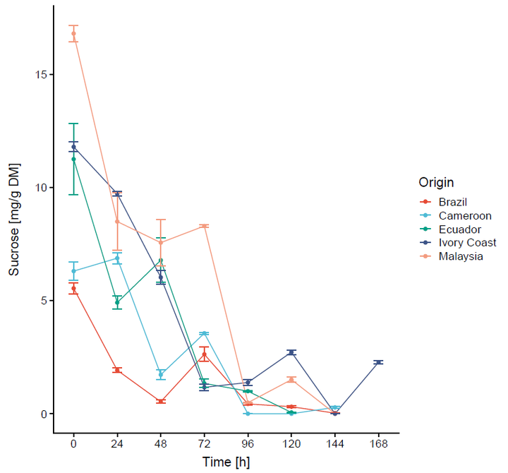

{width="50%" target="_blank"}

Alongside my main research, I collaborated with experimentalists in the group as a statistical consultant. One such collaboration led to a co-authored publication on changes in low-molecular-weight carbohydrates during cocoa fermentation, for which I applied **Generalized Linear Mixed Models (GLMM)** to characterize the differing degradation kinetics of these compounds.

Read the full paper: [Food Research International (2020)](https://doi.org/10.1016/j.foodres.2019.108865){target="_blank"}.
