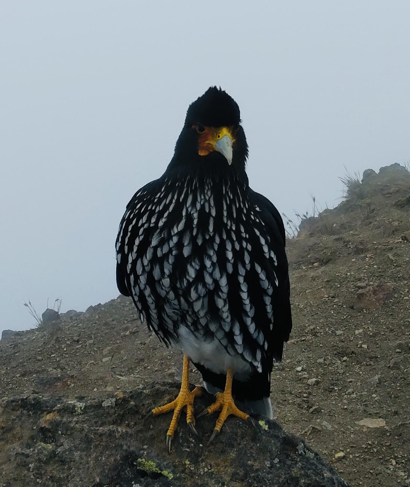
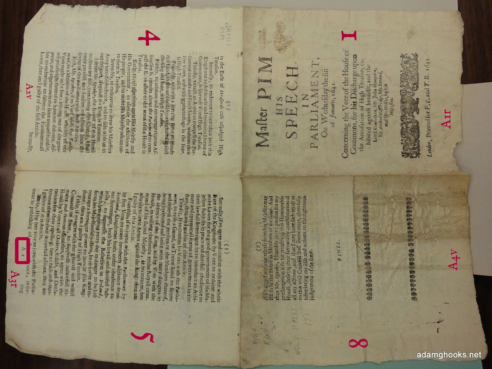

In 2012, I was awarded a scholarship by the Government of Ecuador to pursue an MSc in Statistics at KU Leuven in Belgium. As part of the scholarship program, recipients were encouraged to give back by sharing the knowledge and skills acquired during their studies. I chose to fulfill this commitment by developing and teaching online courses in statistics, a decision that naturally aligned with my long standing passion for education.

My interest in teaching began several years earlier, when I worked as a high school Chemistry teacher at one of Quito's oldest and most established schools. That experience confirmed how rewarding it is to help others build confidence in quantitative subjects and has continued to shape the way I communicate statistical concepts today.

Although I completed my scholarship service years ago, teaching remains an important part of my professional life. I continue to develop and deliver courses because I hope to dedicate a larger part of my career to education in the future, and because I strongly believe that improving statistical literacy can make a meaningful contribution to scientific research and evidence based decision making, particularly in Ecuador.

Below you will find a catalog of the courses and seminars I have taught over the years (in Spanish only).

## Bioestadística en R

::: {.grid}

::: {.g-col-12 .g-col-md-2}

:::

::: {.g-col-12 .g-col-md-10}

**Duración:** 40 horas

**Fecha:** Abril y Mayo 2025

**Sponsor:** Biohack Laboratorio Comunitario

Bioestadística en R es un curso con enfoque práctico orientado al análisis de datos en biología y agricultura. A lo largo del curso se guía a los participantes a través del flujo completo de una investigación, desde la formulación de preguntas y el diseño experimental hasta el análisis e interpretación de resultados. Se abordan herramientas de análisis exploratorio, visualización de datos y estadística descriptiva, así como buenas prácticas de limpieza, documentación y programación. El curso enfatiza el uso aplicado del lenguaje R y fomenta el trabajo con datos propios de los participantes, reflejando su uso actual tanto en la academia como en la industria.

[Material disponible aquí](https://mmorenozam.github.io/biohack_progR/)

:::

:::

## Introducción a la Estadística para Ciencias Biológicas con R

::: {.grid}

::: {.g-col-12 .g-col-md-2}

:::

::: {.g-col-12 .g-col-md-10}

**Duración:** 40 horas

**Fecha:** Septiembre y Octubre 2024

**Sponsor:** Biohack Laboratorio Comunitario

Introducción a la Estadística para Ciencias Biológicas con R es un curso orientado a brindar una base práctica en el uso de metodologías estadísticas aplicadas a la biología y la agricultura. El curso recorre las distintas etapas del análisis de datos en una investigación, desde la formulación de preguntas y el diseño experimental hasta el análisis e interpretación de resultados. Se enfatizan herramientas de análisis exploratorio, estadística descriptiva y visualización de datos, junto con aspectos operativos como la limpieza, preparación y documentación de datos. A lo largo del curso se promueve el uso aplicado del lenguaje R y el trabajo con datos reales, reflejando prácticas actuales en investigación académica y aplicada.

[Material disponible aquí](https://mmorenozam.github.io/biohack-website/)

:::

:::

## Creación de Reportes con Quarto y R

::: {.grid}

::: {.g-col-12 .g-col-md-2}

:::

::: {.g-col-12 .g-col-md-10}

**Duración:** 40 horas

**Fecha:** Septiembre y Octubre 2024

**Sponsor:** Sociedad Ecuatoriana de Estadística

Creación de Reportes con Quarto y R es un curso práctico enfocado en la elaboración de documentos técnicos y científicos reproducibles utilizando Quarto y el lenguaje R. A lo largo del curso, los participantes aprenden a integrar análisis estadísticos con texto, tablas y visualizaciones para comunicar resultados de manera clara y profesional. Se abordan aspectos clave como limpieza de datos, análisis exploratorio y pruebas estadísticas básicas, culminando en la generación de reportes en formatos Word, PDF y HTML. El curso está diseñado para ser accesible a personas sin formación previa profunda en estadística o programación, facilitando la adopción de buenas prácticas de análisis y comunicación científica.

[Material disponible aquí](https://mmorenozam.github.io/see-quarto-website/)

:::

:::

## Introducción a la visualización de datos y creación de reportes en R

::: {.grid}

::: {.g-col-12 .g-col-md-2}

:::

::: {.g-col-12 .g-col-md-10}

**Duración:** 40 horas

**Fecha:** Octubre y Noviembre 2023

**Sponsor:** Universidad Central del Ecuador

Introducción a la visualización de datos y creación de reportes en R es un curso práctico orientado al análisis, visualización y comunicación de datos utilizando el lenguaje R. Los participantes adquieren habilidades para la manipulación y limpieza de datos, el análisis exploratorio y la aplicación de metodologías estadísticas básicas. El curso enfatiza la creación de gráficos profesionales mediante ggplot2 y la elaboración de reportes reproducibles utilizando Quarto. Está diseñado para personas con conocimientos iniciales en R y estadística, y busca fortalecer buenas prácticas de programación y presentación de resultados en contextos académicos y aplicados.

[Material disponible aquí](https://mmorenozam.github.io/progR-website/)

:::

:::

## Estadística Aplicada con R

::: {.grid}

::: {.g-col-12 .g-col-md-2}

:::

::: {.g-col-12 .g-col-md-10}

**Duración:** 40 horas

**Fecha:** Abril 2023

**Sponsor:** Universidad Central del Ecuador

Estadística aplicada con R es un curso orientado al uso práctico de herramientas estadísticas para el análisis de datos mediante el lenguaje R. El curso cubre desde fundamentos de programación y análisis exploratorio de datos hasta principios de diseño de experimentos y métodos inferenciales. Se abordan técnicas estadísticas paramétricas y no paramétricas, análisis de varianza y modelos de regresión, enfatizando su correcta aplicación e interpretación. A lo largo del curso se promueve el uso de visualización de datos y buenas prácticas de análisis para apoyar la toma de decisiones en contextos científicos y aplicados.

[Material disponible aquí](https://mmorenozam.github.io/est-apl-uce-2023-website/)

:::

:::
